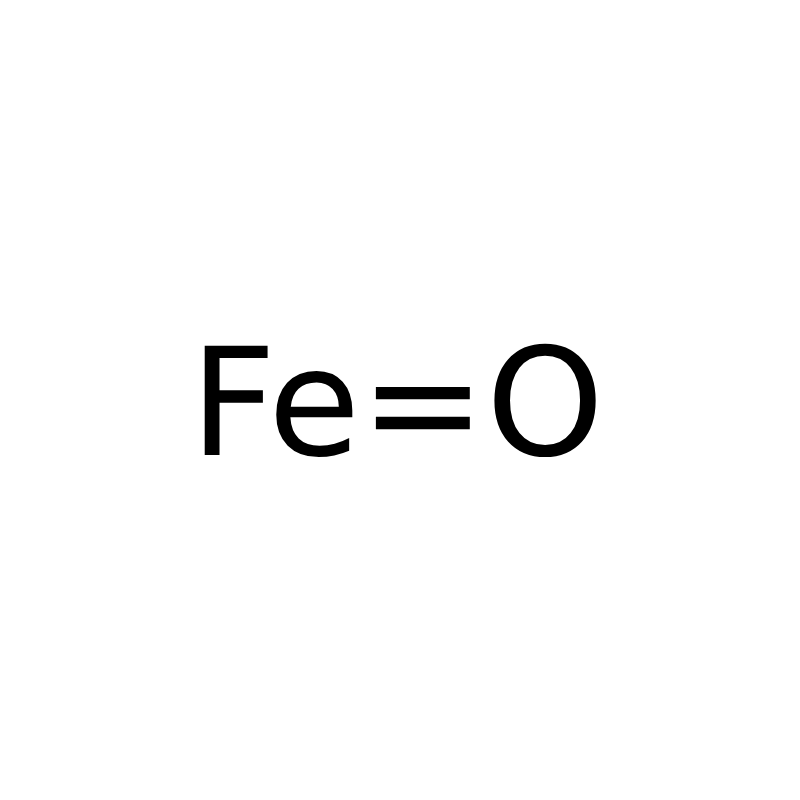

<div align="center">
	

# FeOx

A lightweight interpreted language for numerical computation and algorithmic experimentation
</div>

<p align="center">
	
	
	
	<a href="https://discord.gg/g3YnbAdufv">
		
	</a>
</p>

> [!WARNING]
> FeOx is experimental.
>
> The language syntax may change between releases.
> 
---

FeOx is a lightweight interpreted programming language designed for fast numerical computation and algorithmic experimentation.
It is not a general purpose language; instead it focuses on:
- integer and modular arithmetic
- combinatorics and sequence-based computations
- exhaustive search algorithms

FeOx prioritizes simplicity while providing all the necessary features needed for efficient problem solving.


---
### Examples
[Sum Square Difference](https://projecteuler.net/problem=6)
```feox
(1..=100).sum() ** 2 - (1..=100).map(|x| x * x).sum();
```

[Multiples of 3 or 5](https://projecteuler.net/problem=1)
```feox
(1..1000).filter(|x| (x % 3 == 0) | (x % 5 == 0)).sum();
```

Find the square root of 56480 modulo 1e9 + 9
```feox
mod 1e9 + 9 {
	(1..=1e9).filter(|x| x * x == 56480).first();
};
```

---
### Installation
Download the latest release from:

https://github.com/feox-lang/feox/releases 

